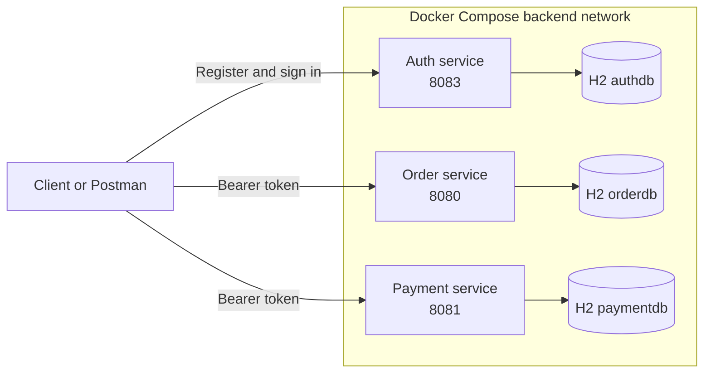

# E-Commerce Microservices

A local learning project that demonstrates authentication, order management, and payment processing with Java 17, Spring Boot 3.5, Docker, and Kubernetes.

The three services issue and validate the same JSON Web Token (JWT), but each service owns its own H2 in-memory database.

## Architecture



The services currently expose separate host ports:

| Service | Host address | Container port | Responsibility |
|---|---|---:|---|
| Authentication | `http://localhost:8083` | 8083 | Registration, sign-in, and token issuance |
| Orders | `http://localhost:8090` | 8080 | Order creation, lookup, status changes, and deletion |
| Payments | `http://localhost:8081` | 8081 | Simulated payment processing and payment lookup |

Port `8090` is used for orders on the host because port `8080` is already used by another local container.

## Quick start

### Prerequisites

- Docker Desktop
- Git
- Postman or another Hypertext Transfer Protocol (HTTP) client
- Java 17 only if you want to run Maven tests outside Docker

### Start the application

From the repository root:

```bash
docker compose up -d --build
docker compose ps
```

All three services should become `healthy`.

Check their readiness:

```bash
curl http://localhost:8083/actuator/health/readiness
curl http://localhost:8090/actuator/health/readiness
curl http://localhost:8081/actuator/health/readiness
```

Stop the application:

```bash
docker compose down
```

For the complete Docker and Kubernetes workflow, see [DOCKER_KUBERNETES.md](DOCKER_KUBERNETES.md).

## Authentication

Register a user:

```http
POST http://localhost:8083/api/auth/signup
Content-Type: application/json
```

```json
{
  "username": "testuser",
  "email": "testuser@example.com",
  "password": "password123"
}
```

Sign in:

```http
POST http://localhost:8083/api/auth/signin
Content-Type: application/json
```

```json
{
  "username": "testuser",
  "password": "password123"
}
```

The response contains a `token`. Protected requests must send it as:

```http
Authorization: Bearer <token>
```

Tokens expire after one hour. Sign in again when a valid request begins returning `401 Unauthorized` or `403 Forbidden`.

## Complete business flow

Payment creation and order-status updates are deliberately separate in the current implementation:

```text
Register → Sign in → Create order → Process payment → Mark order PAID → Verify
```

### 1. Create an order

```http
POST http://localhost:8090/api/orders
Authorization: Bearer <token>
Content-Type: application/json
```

```json
{
  "userId": 5,
  "customerName": "Test Customer",
  "totalAmount": 150.00
}
```

Example response:

```json
{
  "id": 4,
  "userId": 5,
  "username": "testuser",
  "status": "PENDING",
  "totalAmount": 150.00,
  "paymentId": null,
  "orderItems": []
}
```

The response field `id` is the order identifier. Use that value as `orderId` in subsequent requests.

The current create-order request accepts `userId`, `customerName`, and `totalAmount`. It does not yet accept `orderItems`; unknown item data is ignored.

### 2. Read the order

```http
GET http://localhost:8090/api/orders/4
Authorization: Bearer <token>
```

Order reads use response Data Transfer Objects (DTOs), so lazily loaded persistence relationships are not serialized after their database transaction has closed.

### 3. Process the payment

```http
POST http://localhost:8081/api/payments/process
Authorization: Bearer <token>
Content-Type: application/json
```

```json
{
  "orderId": "4",
  "amount": 150.00,
  "currency": "EUR",
  "paymentMethod": "TEST_CARD"
}
```

The service simulates a successful payment and returns `COMPLETED`. If retries create multiple payments for one order, lookup by order identifier returns the newest attempt.

### 4. Mark the order as paid

Select `PUT` as the request method and enter only the Uniform Resource Locator (URL):

```http
PUT http://localhost:8090/api/orders/4/status?status=PAID
Authorization: Bearer <token>
```

There is no request body.

### 5. Verify the result

```http
GET http://localhost:8090/api/orders/4
Authorization: Bearer <token>
```

The order should now contain `"status": "PAID"`.

For a complete Postman collection sequence, assertions, cleanup, and troubleshooting, see [POSTMAN.md](POSTMAN.md).

## Endpoint reference

All order and payment endpoints require a valid Bearer token.

### Authentication service

| Method | Endpoint | Description |
|---|---|---|
| `POST` | `/api/auth/signup` | Register a user |
| `POST` | `/api/auth/signin` | Sign in and obtain a token |

### Order service

| Method | Endpoint | Description |
|---|---|---|
| `POST` | `/api/orders` | Create an order |
| `GET` | `/api/orders` | List all orders |
| `GET` | `/api/orders/{id}` | Get one order |
| `GET` | `/api/orders/user/{userId}` | List orders for a user |
| `PUT` | `/api/orders/{id}/status?status=PAID` | Change order status |
| `DELETE` | `/api/orders/{id}` | Delete an order |

### Payment service

| Method | Endpoint | Description |
|---|---|---|
| `POST` | `/api/payments/process` | Process a simulated payment |
| `GET` | `/api/payments` | List all payments |
| `GET` | `/api/payments/{id}` | Get one payment |
| `GET` | `/api/payments/order/{orderId}` | Get the newest payment attempt for an order |
| `PUT` | `/api/payments/{id}` | Update a payment |
| `DELETE` | `/api/payments/{id}` | Delete a payment |

## Running the tests

Each service has its own Maven wrapper:

```bash
cd auth-service && ./mvnw test
cd ../order-service && ./mvnw test
cd ../payment-service && ./mvnw test
```

The order and payment suites include repository regression tests for order serialization and repeated payment attempts.

## Project structure

```text
.
├── auth-service/             Authentication service and Dockerfile
├── order-service/            Order service and Dockerfile
├── payment-service/          Payment service and Dockerfile
├── k8s/                      Docker Desktop Kubernetes manifests
├── compose.yaml              Local three-service Docker environment
├── DOCKER_KUBERNETES.md      Container and Kubernetes guide
├── POSTMAN.md                End-to-end Application Programming Interface test guide
└── README.md
```

## Technology stack

| Area | Technology |
|---|---|
| Language | Java 17 |
| Framework | Spring Boot 3.5 |
| Security | Spring Security and JSON Web Tokens |
| Persistence | Spring Data Java Persistence API (JPA) |
| Development database | H2 in-memory database |
| Build | Maven wrapper |
| Containers | Docker and Docker Compose |
| Orchestration learning environment | Docker Desktop Kubernetes |
| Health checks | Spring Boot Actuator |

## Current limitations

- H2 data is held in memory. Recreating a container or Pod deletes that service's data.
- Restarting only one stateful service can leave order and payment identifiers out of sync.
- Creating a payment does not automatically update its order; the client must perform both calls.
- The create-order endpoint does not yet accept or calculate `orderItems`.
- There is no Application Programming Interface (API) gateway; clients address each service separately.
- The included signing key fallback is for local development only. Set `JWT_SECRET` to a secure Base64-encoded value outside local development.
- There is no centralized logging, distributed tracing, rate limiting, or persistent production database.

## Suggested next steps

1. Accept order items and calculate totals on the server.
2. Connect successful payments to order state changes using synchronous communication or events.
3. Replace H2 with one PostgreSQL database per service.
4. Add an API gateway and Transport Layer Security termination.
5. Add metrics, centralized logs, and distributed traces.
6. Add idempotency keys and database constraints for payment requests.

## License

MIT
